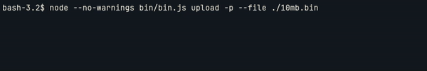

## Check Filebit URL & Get Parts
```javascript
import {Utils} from 'filebit-node';
const URL = 'https://filebit.net/f/qknI9LX#Ac1A3HJ13aBRn66XHnkktQNlOK1dxItiRqnkAovV82uU';

console.log(Utils.isValidURL(URL)); // => true
console.log(Utils.getParts(URL));
/*
{
  id: 'qknI9LX',
  hash: 'Ac1A3HJ13aBRn66XHnkktQNlOK1dxItiRqnkAovV82uU',
  admincode: false
}
*/
```

## Get Upload Server
```javascript
import {CApi} from 'filebit-node';
const Api = new CApi();
const ServerResponse = await Api.Call('storage/server.json');
console.log(ServerResponse);
```

## Get File Informations
```javascript
import {CApi, CryptoLib, Utils} from 'filebit-node';
const {formatSize} = Utils;

const Api = new CApi;
const Crypto = CryptoLib.crypto;
const Response = await Api.Call('storage/bucket/info.json',{"file":"teBKKQ6"});
const EncryptedName = Response.filename;

const Key = 'Abts8F6i70LmwgoeUrDe_8RWMmuXBtQj5C_BguRzJL-p';
const DecryptedKey = Crypto.unmergeKeyIv(CryptoLib.base64.decode(Key));
const DecryptedName = await Crypto.decrypt(CryptoLib.base64.decode(EncryptedName), DecryptedKey.kev, DecryptedKey.iv);

console.log('%o Filesize: %o', DecryptedName, formatSize(Response.filesize));
```

## Multi File Information(s)
```javascript
import {CApi, CryptoLib, Utils} from 'filebit-node';
const {formatSize} = Utils;

const Api = new CApi;
const Crypto = CryptoLib.crypto;

const FilesArray = {
  'tlBKQQ6' : 'Abts8F6i70LmwgoeUrDe_1RWMmuXBtQj5C_BguRzJL-p',
  'AfAiPEM' : 'AbotIF8zJdU44b6cF_9f9kXIir_U5AmODfRiWE9xDo2U',
};

const Response = await Api.Call('storage/multiinfo.json', {"files":Object.keys(FilesArray)});

for(const id of Object.keys(Response)) {
  const data = Response[id];
  const Key = FilesArray[id];
  const DecryptedKey = Crypto.unmergeKeyIv(CryptoLib.base64.decode(Key));
  const DecryptedName = await Crypto.decrypt(CryptoLib.base64.decode(data.name), DecryptedKey.kev, DecryptedKey.iv);
  console.log('[%o] %o Filesize: %o', data.state, DecryptedName, formatSize(data.size));
}
```

## File Upload
```javascript
import {
  CUpload
} from 'filebit-node';

const File2Upload = 'test.txt';
const Upload = new CUpload;
Upload.setProgress(true);
Upload.on('finish', (link) => {
  console.log("Done: %o Admincode: %o\n ", link, Upload.getAdminCode())
});
//Upload.setRateLimit(131072);
await Upload.init(File2Upload);
Upload.upload(true);
```

## File Download
```javascript
import {
  CDownload,
  Utils
} from 'filebit-node';
const {
  getParts
} = Utils;

const URL = 'https://filebit.net/f/...#...';
const URLParts = getParts(URL);
const Download = new CDownload(URLParts.id, URLParts.hash);
Download.on('finish', (path) => {
  console.log(path)
});
await Download.setStoragePath('./test.txt');
Download.setProgress(true);
await Download.download();
```

## CLI Usage
the library needs to be linked
### Upload
```bash
bash-3.2$ filebit-node upload --help
Usage: filebit-node upload [options]

Options:
  --file <string>
  --rate-limit <number>
  --tpl <string>         output template ex: --tpl='{"link":"%s"}'
  -p, --progress
  -h, --help             display help for command
```
> Example
```bash
filebit-node upload --file ./100MB.bin --tpl='{"link":"%s"}' -p
```


### Download
```bash
bash-3.2$ filebit-node download --help
Usage: filebit-node download [options]

Options:
  --url <string>
  --path <string>
  --tpl <string>   output template ex: --tpl='{"link":"%s"}'
  -p, --progress
  -h, --help       display help for command
```
> Example
```bash
filebit-node download --url='https://filebit.net/f/...#...' --path='./downloaded.bin' -p --tpl='{"path":"%s"}'
```

## CommonJS Usage
You will need to import the module instead of "require" it, todo so, simply use the `import` statement.
>Dynamic import() is supported in both CommonJS and ES modules. In CommonJS modules it can be used to load ES modules.
click [here](https://nodejs.org/api/esm.html#import-expressions) for more informations.
```javascript
const fbNode = await import('filebit-node');
````

## Fetch error message
```bash
(node:51976) ExperimentalWarning: The Fetch API is an experimental feature. This feature could change at any time
(Use `node --trace-warnings ...` to show where the warning was created)
```
You can start node with the parameter `--no-experimental-fetch` we then use `undici` as polyfill library
which in the end is the library which node uses under the hood, so all features are expected to work properly.
You can also simply suppress the warning which we do in our bin/bin.js file.
```javascript
process.removeAllListeners('warning')
```
just add this line to the beginning of your file.